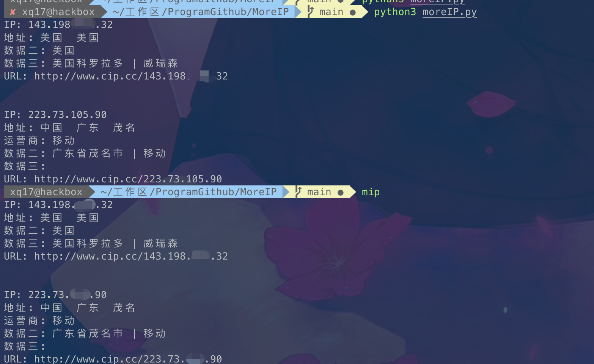
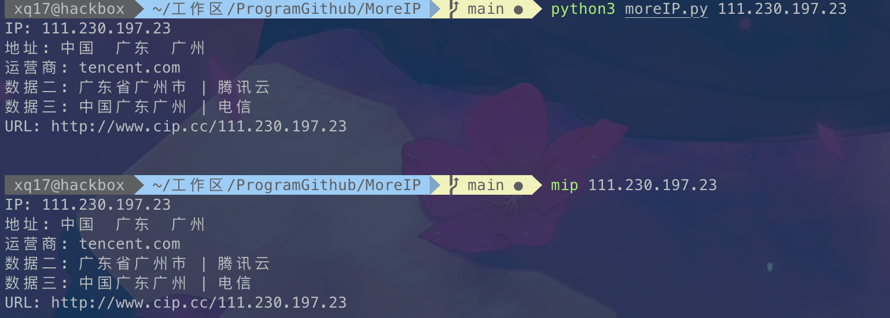

# MoreIP
 一款基于Python的面向 MacOS/Linux 用户用于查询IP/域名信息的日常渗透小工具。


# Installtion

```
git clone https://github.com/mstxq17/MoreIP.git
cd MoreIP
pip3 install -r requirements.txt
```

or if you  want to run it in command, you can install it to env(default path: `/usr/local/bin/`):

```
git clone https://github.com/mstxq17/MoreIP.git
cd MoreIP
chmod +x install.sh
./install.sh
```

after, you can use `mip` in  command, try.

# Usage

(1) None argument, will check local ip.



(2) single argument, if ip, will check the ip given.



(3)single argument,if domain,will `ping` the domain given from other position and return data.


# End

So simple the script,  So helpful for me!


